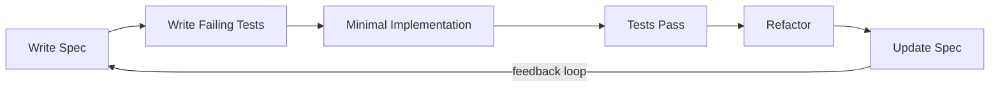

# Development Workflow: SDD → TDD → BDD

## Overview

Every feature follows the same cycle. Specs come first, tests come before code, code makes tests green.



## The Seven Steps

### Step 0: Check for existing decisions

Before designing anything, read `docs/decisions/`. There may be ADRs that constrain your choices. If this feature involves a major technology or architecture decision, write an ADR first.

### Step 1: Write the Feature Spec

Create `docs/specs/{feature-name}.md` using the feature spec template.

**What to write:**
1. One-line goal from user's perspective (no technology names)
2. Behavior constraints as precondition/behavior/postcondition triples
3. State machine if the feature has stateful behavior
4. Acceptance Criteria — each one verifiable by a single test
5. BDD Gherkin scenarios derived from AC (for E2E tests)
6. TDD unit test pointers (what to test, which module — not the full test code)

**Spec review checklist:**
- Every AC can be verified by one test?
- No UI details (button colors, pixel values)?
- No implementation technology in behavior constraints?
- Both happy path and error paths covered?

### Step 2: Update module contracts (if needed)

If this feature adds or changes a module's public API, update `docs/modules/{module}.md` first. Interface changes should be agreed upon before code is written.

### Step 3: Write failing tests (RED)

**3a. Unit tests first:**

From the spec's "TDD Pointers" section, create test cases. All should fail:

```typescript
// test/unit/{module}.test.ts
describe('{module}', () => {
  it('should {expected behavior} when {condition}', () => {
    // Arrange
    // Act
    // Assert — this fails because the code doesn't exist yet
  })
})
```

Run in watch mode: `pnpm test:unit --watch`

**3b. E2E test skeletons (if project uses automated E2E):**

From the spec's BDD Scenarios, create Playwright test files. Use `test.skip` initially:

```typescript
// tests/{feature}.spec.ts
test.skip('{scenario from BDD}', async ({ page }) => {
  // Given: {precondition}
  // When: {action}
  // Then: {expectation}
})
```

If the project uses manual testing instead, prepare the manual test checklist entries from BDD scenarios at this stage — they'll be executed in Step 6.

### Step 4: Write minimal implementation (GREEN)

Implementation order matters — go bottom-up:

1. `packages/shared` — type definitions
2. `stores/` — state and pure logic (unit tests go green here)
3. `services/` — external integrations
4. `components/` — UI (integration tests go green here)

**Rule:** Only write code that makes a currently-failing test pass. No extra features, no premature abstractions.

### Step 5: Refactor

With all tests green:

- Extract duplication
- Improve naming
- Simplify structure
- Keep tests green throughout

### Step 6: Verify BDD scenarios

**If project uses automated E2E:** Remove `test.skip` from Playwright tests. Run `pnpm test:e2e`. Fix until all pass.

**If project uses manual testing:** Execute the manual test checklist from Step 3b. Record pass/fail results with tester name and date. Any failure → fix the code and re-test.

### Step 7: Update spec status

Mark implemented AC as `[x]`. This is the SDD discipline — specs and code stay in sync:

```markdown
- [x] **AC-01**: Node enters generating state when generate clicked
- [x] **AC-02**: Generate button disabled during generation
- [ ] **AC-03**: Upstream data flows through connections (not yet implemented)
```

---

## Rules

1. **No code without spec** — If there's no spec, write one first (even a minimal one)
2. **AC = Test** — Every AC has exactly one test. No untested AC, no test without AC
3. **Spec and code stay in sync** — When code changes, update AC status immediately
4. **ADR for big decisions** — Technology choices, architecture changes, major library introductions get an ADR
5. **Bottom-up implementation** — Types → Logic → Services → UI

## When to skip steps

SDD is a tool, not a religion. Use judgment:

- **Trivial bug fix**: Skip spec, write test, fix bug, done
- **Hotfix**: Fix first, write spec after (but do write it)
- **Prototype/spike**: Skip tests, but mark the code clearly as "spike — needs spec before merge"
- **Documentation-only change**: No tests needed

## Quick Reference

```bash
# Start feature development
# 1. Write spec in docs/specs/
# 2. Run tests in watch mode
pnpm test:unit --watch

# Before committing
pnpm test && pnpm typecheck && pnpm lint

# E2E validation
pnpm test:e2e
```
