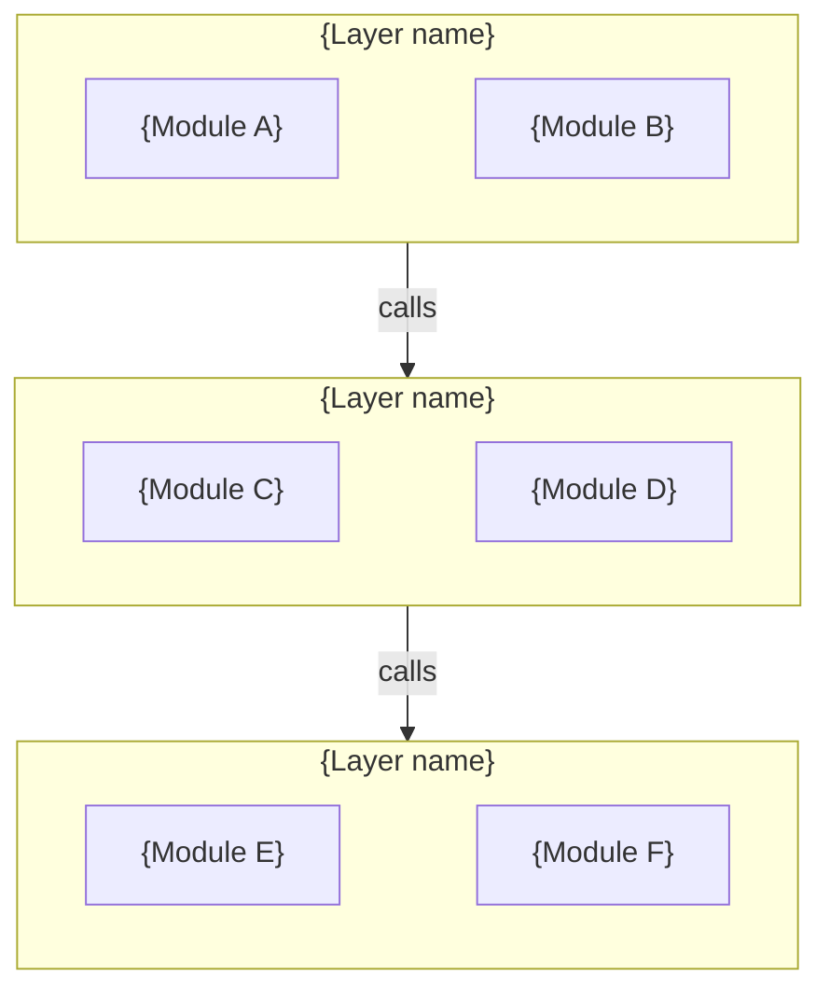

# WHAT Layer Templates

The WHAT layer answers "what does each module/feature do?". These documents change per feature. The VERIFY layer (AC, BDD, TDD) is embedded inside feature specs — testing lives next to the behavior it verifies.

Contents:
1. [Architecture](#architecture-template) — system-level structure and module registry
2. [Module Contract](#module-contract-template) — module boundaries and public API
3. [Feature Spec](#feature-spec-template) — feature behavior + AC + BDD + TDD pointers

---

## Architecture Template

System-level structure: layering, data flow, external integrations, module registry. One file for the whole project.

````markdown
# Architecture

## System Overview

{2-3 sentences: what the system does and its high-level structure.}

## Layer Diagram



## Data Flow

{Describe how data moves through the system — from user input or external trigger to final output/persistence. Use text, not diagrams.}

## External Integrations (if applicable)

| System | Purpose | Interface |
|--------|---------|-----------|
| {system} | {why we integrate} | {API / SDK / message queue / etc.} |

## Module Registry

| Module | Contract | Main source |
|--------|----------|-------------|
| {Name} | [{name}.md](modules/{name}.md) | `{path}` |
````

---

## Module Contract Template

The core SDD document for defining module boundaries. Answers "what does this module do" without saying "how".

````markdown
# Module: {Name}

> {One sentence: this module's single responsibility.}

## Boundary

**Owns:**
- {Responsibility 1 — verb phrase}
- {Responsibility 2}

**Does NOT own (caller's responsibility):**
- {Excluded responsibility 1}
- {Excluded responsibility 2}

## Public API

> See source: `{file path to barrel export or main module file}`

List method/function **names** and one-line purpose. Do NOT copy full signatures — they go stale. The source file is the single source of truth.

| Export | Purpose |
|--------|---------|
| `{name}` | {what it does} |

## Events Published (if applicable)

| Event | Payload | When |
|-------|---------|------|
| {event} | {type} | {trigger condition} |

## Dependencies Consumed

| Module | API used | Purpose |
|--------|----------|---------|
| {module} | {method/property} | {why} |

## State Machine (if stateful)

```mermaid
stateDiagram-v2
    {state} --> {state}: {trigger}
```

| Current | Event | Next | Side Effect |
|---------|-------|------|-------------|
| {state} | {event} | {state} | {what happens} |

## Invariants

Conditions that must always hold. Violation = bug:

1. {Invariant in assertion language, e.g., "Node IDs are unique within a Canvas"}
2. {Invariant}

## Error Scenarios

| Scenario | Module behavior | Caller should |
|----------|----------------|---------------|
| {scenario} | {what this module does} | {what caller should expect} |

## Implementation

| Role | Path |
|------|------|
| Main | `{file path}` |
| Types | `{file path}` |
| Tests | `{file path}` |
````

---

## Feature Spec Template

The most important template in SDD — it drives both development and testing. Includes embedded VERIFY content (AC + BDD + TDD).

````markdown
# Feature: {Name}

## Goal

{What the user can do and what value it produces. No technology names. One sentence.}

## Behavior Constraints

Each constraint is a precondition/behavior/postcondition triple. These are the formal rules the implementation must satisfy.

### Constraint 1: {Name}

**Pre:** {What must be true before this behavior applies}
**Behavior:** {What the system does — active voice, present tense}
**Post:** {What must be true after the behavior completes}

### Constraint 2: {Name}

**Pre:** ...
**Behavior:** ...
**Post:** ...

## State Machine (if applicable)

```mermaid
stateDiagram-v2
    {state} --> {state}: {trigger}
```

## Acceptance Criteria

Each AC maps to exactly one test. Mark `[x]` when implemented and tested.

- [ ] **AC-01**: {Verifiable behavior description}
- [ ] **AC-02**: {Verifiable behavior description}
- [ ] **AC-03**: {Verifiable behavior description}

## BDD Scenarios

Derived from AC. These describe user-visible behavior and can be verified either by automated E2E tests or manual testing — the project decides which.

```gherkin
Feature: {Feature name}

  # Maps to AC-01
  Scenario: {Happy path description}
    Given {precondition}
    When {user action}
    Then {expected outcome}

  # Maps to AC-03
  Scenario: {Error/edge case description}
    Given {precondition}
    When {user action}
    Then {expected outcome}
```

**Verification method** (choose one per project, note in `docs/guides/testing.md`):
- **Automated**: Each scenario maps to an E2E test file (Playwright / Cypress / etc.)
- **Manual**: Each scenario maps to a manual test checklist entry with pass/fail record

## TDD Pointers

Unit test direction for pure logic. Each points to the module and function to test — not the full test implementation.

**{Module/function name}:**
- Test: {what behavior to verify} (maps to AC-{NN})
- Test: {boundary condition}

## Out of Scope

- {What this spec explicitly does NOT cover}
````
