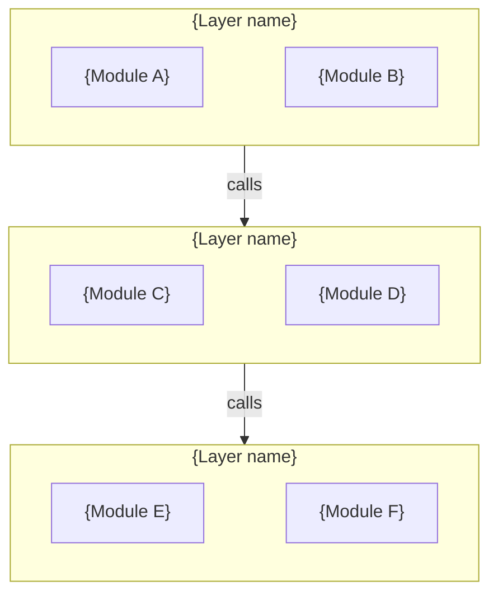

# SDD Document Templates

Adapt these templates to the specific project. Remove sections that don't apply, add sections that are needed. The templates encode the SDD four-layer architecture — each template belongs to a specific layer.

---

## Table of Contents

1. [CLAUDE.md Template](#claudemd-template) — Agent entry point
2. [Product Vision Template](#product-vision-template) — WHY layer
3. [Product Scope Template](#product-scope-template) — WHY layer
4. [Glossary Template](#glossary-template) — WHY layer
5. [Architecture Template](#architecture-template) — WHAT layer
6. [Module Contract Template](#module-contract-template) — WHAT layer
7. [Feature Spec Template](#feature-spec-template) — WHAT+VERIFY layer
8. [ADR Template](#adr-template) — HOW layer
9. [Conventions Template](#conventions-template) — HOW layer
10. [Design System Template](#design-system-template) — HOW layer

---

## CLAUDE.md Template

The most important file. Concise, declarative, scannable. Under 150 lines.

```markdown
# {Project Name}

{One sentence: what this project does.}

## Tech Stack

- Language: {e.g., TypeScript}
- Framework: {e.g., Nuxt 4 / Next.js 15 / SvelteKit}
- UI: {e.g., Nuxt UI v4 / shadcn}
- State: {e.g., Pinia / Zustand}
- Testing: {e.g., Vitest + Playwright}
- Styling: {e.g., Tailwind CSS 4}
- Package Manager: {e.g., pnpm 10}
- Node: >= {version}

## Project Structure

{Minimal tree showing key directories and their purpose}

## Development Commands

{Essential commands only: install, dev, build, test, lint}

## Coding Conventions

{Top 5-7 rules. Link to docs/guides/conventions.md for full list.}

## Development Methodology

This project follows SDD (Spec-Driven Development) with TDD and BDD:
- Every feature starts with a spec in `docs/specs/`
- Specs contain Acceptance Criteria that map 1:1 to tests
- Module contracts in `docs/modules/` define interface boundaries

See docs/guides/dev-workflow.md for the full process.

## Documentation Index

| Document | When to read |
|----------|-------------|
| docs/product/vision.md | Understanding product goals |
| docs/product/scope.md | What's in/out of scope |
| docs/product/glossary.md | Understanding domain terminology |
| docs/architecture.md | System structure and module overview |
| docs/modules/ | Module responsibilities and interfaces |
| docs/specs/ | Feature behavior and test criteria |
| docs/decisions/ | Before proposing architectural changes |
| docs/guides/conventions.md | Before writing new code |
| docs/guides/design-system.md | Implementing UI |
| docs/guides/testing.md | Writing tests |
| docs/guides/dev-workflow.md | SDD development process |
```

---

## Product Vision Template

WHY layer. Stable — changes quarterly at most.

```markdown
# Product Vision

## Positioning

{One sentence: what is this product?}

## Target Users

- {User type 1}: {their pain point, what they need}
- {User type 2}: {their pain point, what they need}

## Core Value

Why users choose this over alternatives:

1. {Value 1}
2. {Value 2}
3. {Value 3}

## Success Metrics

- {Metric 1: e.g., user can complete core workflow in under 3 minutes}
- {Metric 2}
```

---

## Product Scope Template

WHY layer. Defines boundaries. Under 100 lines.

```markdown
# Product Scope

## P0 — Must have (MVP)

- {Feature A}: {one-sentence description}
- {Feature B}: {one-sentence description}

## P1 — Should have

- {Feature C}: {one-sentence description}

## P2 — Nice to have

- {Feature D}: {one-sentence description}

## Explicitly Out of Scope

These are intentionally excluded. Do not implement them:

- {Thing X}: {why excluded}
- {Thing Y}: {why excluded}

## Non-functional Requirements

| Item | Requirement |
|------|-------------|
| Browser support | {e.g., Chrome, Edge, Safari latest} |
| Responsive | {e.g., Desktop-first, min 1280px} |
| Performance | {e.g., smooth at 100+ nodes on canvas} |
| Theme | {e.g., Dark theme only for MVP} |
| Persistence | {e.g., localStorage for MVP} |
```

---

## Glossary Template

WHY layer. Defines domain terminology used across all documents. Prevents miscommunication between team members and agents. Update when a new domain concept is introduced.

```markdown
# Glossary

| Term | Definition | Context |
|------|-----------|---------|
| {Term} | {Precise definition in this project's context} | {Where this term is used — e.g., specs, module contracts, UI} |
| {Term} | {Definition} | {Context} |
```

Keep entries sorted alphabetically. If a term has a different meaning in general usage vs. this project, note the distinction explicitly.

---

## Architecture Template

WHAT layer. Replaces Module Map. Describes system-level structure: layering, data flow, external integrations, and includes a module registry. One file for the whole project.

```markdown
# Architecture

## System Overview

{2-3 sentences: what the system does and its high-level structure.}

## Layer Diagram



## Data Flow

{Describe how data moves through the system — from user input or external trigger to final output/persistence. Use text, not diagrams.}

## External Integrations (if applicable)

| System | Purpose | Interface |
|--------|---------|-----------|
| {system} | {why we integrate} | {API / SDK / message queue / etc.} |

## Module Registry

| Module | Contract | Main source |
|--------|----------|-------------|
| {Name} | [{name}.md](modules/{name}.md) | `{path}` |
```

---

## Module Contract Template

WHAT layer. This is the core SDD document for defining module boundaries. It answers "what does this module do" without saying "how".

```markdown
# Module: {Name}

> {One sentence: this module's single responsibility.}

## Boundary

**Owns:**
- {Responsibility 1 — verb phrase}
- {Responsibility 2}

**Does NOT own (caller's responsibility):**
- {Excluded responsibility 1}
- {Excluded responsibility 2}

## Public API

> See source: `{file path to barrel export or main module file}`

List method/function **names** and one-line purpose. Do NOT copy full signatures — they go stale. The source file is the single source of truth.

| Export | Purpose |
|--------|---------|
| `{name}` | {what it does} |

## Events Published (if applicable)

| Event | Payload | When |
|-------|---------|------|
| {event} | {type} | {trigger condition} |

## Dependencies Consumed

| Module | API used | Purpose |
|--------|----------|---------|
| {module} | {method/property} | {why} |

## State Machine (if stateful)

```mermaid
stateDiagram-v2
    {state} --> {state}: {trigger}
```

| Current | Event | Next | Side Effect |
|---------|-------|------|-------------|
| {state} | {event} | {state} | {what happens} |

## Invariants

Conditions that must always hold. Violation = bug:

1. {Invariant in assertion language, e.g., "Node IDs are unique within a Canvas"}
2. {Invariant}

## Error Scenarios

| Scenario | Module behavior | Caller should |
|----------|----------------|---------------|
| {scenario} | {what this module does} | {what caller should expect} |

## Implementation

| Role | Path |
|------|------|
| Main | `{file path}` |
| Types | `{file path}` |
| Tests | `{file path}` |
```

---

## Feature Spec Template

WHAT+VERIFY layer. The most important template in SDD — it drives both development and testing.

```markdown
# Feature: {Name}

## Goal

{What the user can do and what value it produces. No technology names. One sentence.}

## Behavior Constraints

Each constraint is a precondition/behavior/postcondition triple. These are the formal rules the implementation must satisfy.

### Constraint 1: {Name}

**Pre:** {What must be true before this behavior applies}
**Behavior:** {What the system does — active voice, present tense}
**Post:** {What must be true after the behavior completes}

### Constraint 2: {Name}

**Pre:** ...
**Behavior:** ...
**Post:** ...

## State Machine (if applicable)

```mermaid
stateDiagram-v2
    {state} --> {state}: {trigger}
```

## Acceptance Criteria

Each AC maps to exactly one test. Mark `[x]` when implemented and tested.

- [ ] **AC-01**: {Verifiable behavior description}
- [ ] **AC-02**: {Verifiable behavior description}
- [ ] **AC-03**: {Verifiable behavior description}

## BDD Scenarios

Derived from AC. These describe user-visible behavior and can be verified either by automated E2E tests or manual testing — the project decides which.

```gherkin
Feature: {Feature name}

  # Maps to AC-01
  Scenario: {Happy path description}
    Given {precondition}
    When {user action}
    Then {expected outcome}

  # Maps to AC-03
  Scenario: {Error/edge case description}
    Given {precondition}
    When {user action}
    Then {expected outcome}
```

**Verification method** (choose one per project, note in `docs/guides/testing.md`):
- **Automated**: Each scenario maps to an E2E test file (Playwright / Cypress / etc.)
- **Manual**: Each scenario maps to a manual test checklist entry with pass/fail record

## TDD Pointers

Unit test direction for pure logic. Each points to the module and function to test — not the full test implementation.

**{Module/function name}:**
- Test: {what behavior to verify} (maps to AC-{NN})
- Test: {boundary condition}

## Out of Scope

- {What this spec explicitly does NOT cover}
```

---

## ADR Template

HOW layer. Records architectural decisions with enough context to understand them later.

```markdown
# ADR-{NNN}: {Decision Title}

## Status

{Accepted | Superseded by ADR-NNN | Deprecated}

## Context

{What situation led to this decision? What constraints exist?}

## Options Considered

### Option A: {Name}
- Pros: {advantages}
- Cons: {disadvantages}

### Option B: {Name}
- Pros: {advantages}
- Cons: {disadvantages}

## Decision

Chose **Option {X}**.

{1-3 sentences: the key tradeoff that made this the right choice.}

## Consequences

**Positive:**
- {benefit}

**Negative / Known risks:**
- {tradeoff}

**Follow-up actions:**
- {what needs to happen as a result}

## Revisit When

{Under what conditions should this decision be re-evaluated?}
```

---

## Conventions Template

HOW layer. Rules an agent must follow when writing code.

```markdown
# Coding Conventions

## File Naming

- Components: {pattern, e.g., `PascalCase.vue`}
- Composables/Hooks: {pattern, e.g., `useCamelCase.ts`}
- Stores: {pattern}
- Utils: {pattern}
- Tests: {pattern, e.g., `[name].test.ts` for unit, `[name].spec.ts` for E2E}

## Directory Placement

- {Rule 1: where new components go}
- {Rule 2: where new services go}
- {Rule 3: where tests go}

## Component Patterns

- {Rule: e.g., Use `<script setup lang="ts">`}
- {Rule: Props/Emits must be typed}
- {Rule: Max ~200 lines per component}

## State Management

- {When to use local state}
- {When to use global store}
- {When to use server state}

## Styling

- {Approach: e.g., utility-first with Tailwind}
- {Specific rules: e.g., use canonical class names}

## TypeScript

- {Strict mode rules}
- {interface vs type guidance}

## Import Order

{Groups and ordering rules}

## Testing Conventions

- Unit tests: AAA pattern (Arrange/Act/Assert), one assertion per behavior
- Integration tests: test public API of stores and composables
- E2E tests: map to BDD scenarios in specs, use `data-testid` attributes
- Test naming: `it('should {expected behavior} when {condition}')`

## Git

- Branch naming: {pattern}
- Commit messages: {convention, e.g., conventional commits}
```

---

## Design System Template

HOW layer. Only for frontend projects with custom visual rules.

```markdown
# Design System

## Style Direction

{1-2 sentences: overall visual feel}

## Colors

### Base Palette
{Primary, neutral, background colors with values}

### Semantic Colors
{Success, warning, error, info}

### Domain Colors (if applicable)
{Project-specific color assignments}

## Typography

{Font family, size scale, weight scale}

## Spacing & Radius

{Base unit, border radius scale}

## Shadows

{Shadow definitions by usage context}

## Animation

{Default transitions, motion preferences}

## Component Library Overrides

{Only document customizations beyond the library defaults}

## Responsive Strategy

{Breakpoints, minimum supported width}
```

