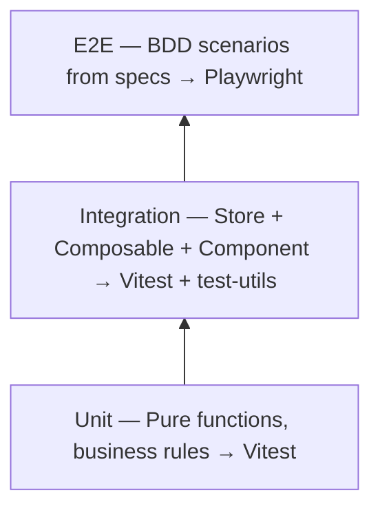

# Testing Strategy

## Test Pyramid



**Principle:** The more a test depends on infrastructure, the fewer of them you need. Pure logic gets the most tests; E2E covers critical user journeys only.

## Layer Responsibilities

### Unit Tests

**Location:** `test/unit/`
**Framework:** Vitest
**Scope:** Pure functions with zero framework dependencies

Good candidates:
- Validation logic (e.g., edge validation, input sanitization)
- Data transformations (format converters, mappers)
- Business rule functions
- State machine transition logic
- Utility functions

**Pattern — AAA (Arrange/Act/Assert):**

```typescript
it('should detect cycle when edge creates loop', () => {
  // Arrange
  const edges = [{ source: 'a', target: 'b' }, { source: 'b', target: 'c' }]
  const newEdge = { source: 'c', target: 'a' }

  // Act
  const result = wouldCreateCycle(edges, newEdge)

  // Assert
  expect(result).toBe(true)
})
```

### Integration Tests

**Location:** `test/nuxt/` (Nuxt) or `test/integration/`
**Framework:** Vitest + framework test utils
**Scope:** Components, stores, composables that depend on framework runtime

Good candidates:
- Pinia store actions and getters
- Composables that use framework APIs (reactivity, lifecycle)
- Component rendering and interaction
- Store ↔ component integration

**Pattern — test public API, not internals:**

```typescript
describe('flowStore', () => {
  beforeEach(() => {
    setActivePinia(createPinia())
  })

  it('should add node and sync to canvas', () => {
    const store = useFlowStore()
    store.addNode('text', { x: 100, y: 200 })

    expect(store.nodes).toHaveLength(1)
    expect(store.nodes[0].type).toBe('text')
  })
})
```

### E2E / Acceptance Tests

**Location:** `tests/` (automated) or manual test checklist
**Framework:** Playwright / Cypress (automated) or structured manual testing
**Scope:** Critical user journeys mapped from BDD scenarios in specs

The project chooses one verification method and documents it in `docs/guides/testing.md`:

- **Automated E2E**: BDD scenarios map to Playwright/Cypress test files
- **Manual testing**: BDD scenarios map to a manual test checklist with structured pass/fail records

Both approaches are valid. Automated E2E is preferred when the project has the infrastructure; manual testing is acceptable when E2E tooling is not integrated.

Good candidates:
- Core user workflows (create → configure → execute)
- Cross-module interactions that integration tests can't cover
- Error recovery flows visible to users

**Pattern A — automated E2E (map from BDD scenarios):**

```typescript
// Spec says:
//   Scenario: Create text node from toolbar
//     Given canvas editor is open
//     When user clicks toolbar add button and selects text
//     Then a text node appears on canvas

test('create text node from toolbar', async ({ page }) => {
  await page.goto('/canvas/test-id')
  await page.click('[data-testid="toolbar-add"]')
  await page.click('[data-testid="node-type-text"]')
  await expect(page.locator('[data-testid="node-text"]')).toBeVisible()
})
```

**Pattern B — manual test checklist (when no E2E framework):**

```markdown
## Manual Test: {Feature name}

| # | Scenario | Steps | Expected | Pass/Fail | Tester | Date |
|---|----------|-------|----------|-----------|--------|------|
| 1 | Create text node from toolbar | 1. Open canvas editor 2. Click toolbar add 3. Select text | Text node appears on canvas | | | |
```

## Spec → Test Mapping

Every test must trace back to a spec:

```
docs/specs/ai-generation-flow.md
  AC-01: "Node enters generating state"
    → test/nuxt/aiGeneration.test.ts: it('should set status to generating')
  AC-02: "Generate button disabled during generation"
    → tests/ai-generation.spec.ts: test('generate button disabled while generating')
```

When you write a test, add a comment referencing the AC:

```typescript
// AC-01: Node enters generating state when generate clicked
it('should set status to generating when generate is called', () => {
  // ...
})
```

## data-testid Conventions

All interactive UI elements should have `data-testid` for E2E tests. Naming pattern:

```
{component}-{element}
{component}-{element}-{variant}
```

Examples:
- `toolbar-add` — toolbar's add button
- `node-type-text` — node type selector for text
- `node-generate` — node's generate button
- `node-status-generating` — status indicator

## Coverage Targets

| Layer | Target | Focus |
|-------|--------|-------|
| Unit | > 90% | Validation, business rules, pure logic |
| Integration | > 70% | All public store actions, key composables |
| E2E / Manual | Critical paths 100% | Every P0 user journey has at least one automated test or manual test record |

These are guidelines, not gates. 90% coverage with meaningful tests beats 100% coverage with trivial assertions.

## When NOT to test

- Third-party library behavior (trust the library)
- CSS/styling (unless testing conditional class application)
- Static content rendering
- Framework internals (Vue reactivity, Nuxt auto-imports)

## Test File Naming

```
test/unit/{module}.test.ts          # Unit tests
test/nuxt/{component|store}.test.ts # Integration tests
tests/{feature}.spec.ts             # E2E tests
```

Match the `{feature}` name to the spec filename in `docs/specs/` for easy tracing.
